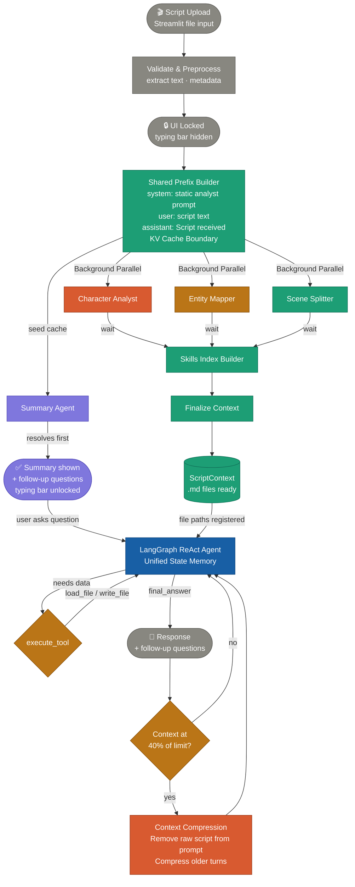

# Script Analysis System

An agentic AI system designed to analyze short-form scripts and generate structured storytelling insights through a unified, memory-aware pipeline.

## What the Agent Can Do

This system continuously processes and reasons about script content using an intelligent loop:

1. **Upload & Initial Insight**: Upon script upload, a summary is generated instantly. Simultaneously, deep analysis for characters, entity mapping, and scene splitting run in the background.
2. **Stateful Conversation**: A ReAct (Reasoning and Acting) agent powered by LangGraph maintains conversation memory. It autonomously determines when to use specialized tools to pull deep insights from pre-generated analysis files to answer your questions.
3. **Context Budget Management**: Automated context engineering manages the LLM context window. When the budget hits 40% of the model's limit, the system compresses the conversation history and drops the raw script to maintain optimal performance and reduce costs.

## Core Design Principles

- **Progressive Disclosure**: The system is built to provide immediate value while doing heavy lifting in the background. The script summary is shown instantly to the user, while background analysis completes silently. Deeper insights are retrieved on-demand as the user asks specific questions.
- **Shared KV-Cache Prefix**: Background tasks (Summary, Character Analysis, Entity Mapping, Scene Splitting) share a common system prompt and script prefix to maximize AI prompt caching performance, significantly reducing latency and cost.
- **Parallel Processing**: Initial background tasks execute concurrently using `asyncio`.
- **Skill-based Architecture & Unified Context**: Generated analysis files (e.g., character traits, scene entities) are treated as modular "skills." The agent dynamically loads only the required skill files into its working memory when needed to answer a user's question, rather than stuffing the entire context at once.
- **Interactive Feedback**: Every agent response generates relevant follow-up "chips" to guide the user deeper into the analysis.

## System Flow



## Project Structure

```
script-analysis/
│
├── agents/                  # LangGraph nodes
│   ├── summary.py           # Initial Summary Generator
│   ├── characters.py        # Character Analyst
│   ├── entity_mapper.py     # Entity Mapper
│   ├── scene_splitter.py    # Script Scene Fragmenter
│   ├── skills_index_builder.py # Skills/Files Indexer
│   └── conversation_graph.py# Stateful ReAct Agent (LangGraph)
│
├── core/                    # Core logic & utilities
│   ├── context.py           # ScriptContext source of truth
│   ├── pipeline.py          # Pipeline orchestration
│   ├── context_manager.py   # 40% threshold compression logic
│   ├── llm.py               # Structured output & token tracking
│   ├── prompts.py           # Dynamic system prompt builder
│   └── tools.py             # Agent tools (load_file, write_file)
│
├── models/                  # Pydantic output schemas
│   ├── entities.py
│   ├── characters.py
│   └── summary.py
│
├── ui/                      # Frontend
│   └── app.py               # Streamlit Dashboard & Chat Interface
│
├── outputs/                 # Analysis assets (auto-generated)
│   ├── character_analysis.md
│   ├── entity_map.md
│   └── skills_index.md
│
└── requirements.txt
```

## Local Setup Guidelines

Follow these steps to run the Script Analysis System locally:

1. **Clone the repository**
   ```bash
   git clone <repository-url>
   cd content_agent
   ```

2. **Environment Setup & Dependencies (using `uv`)**
   We recommend using [`uv`](https://github.com/astral-sh/uv) for lightning-fast environment setup:
   
   ```bash
   # Install uv (if you haven't already)
   curl -LsSf https://astral.sh/uv/install.sh | sh
   
   # Create a virtual environment
   uv venv
   
   # Activate the environment
   source .venv/bin/activate  # On Windows use: .venv\Scripts\activate
   
   # Install dependencies
   uv pip install -r requirements.txt
   ```
   
   *(Alternatively, you can use standard `python -m venv venv` and `pip install -r requirements.txt`)*

4. **Environment Variables**
   Create a `.env` file in the root directory and add your OpenAI API key:
   ```env
   OPENAI_API_KEY=your-api-key-here
   ```

5. **Run the Application**
   Launch the Streamlit UI:
   ```bash
   streamlit run ui/app.py
   ```

## Future Directions & Improvements

To further enhance the capabilities and robust nature of the agent, the following architectural and feature updates are planned:

- **MCP Tool Server integration**: Transition the tool execution layer to act as a Model Context Protocol (MCP) server, standardizing how context and tools are provided.
- **Long-term Memory**: Implement persistent cross-session memory (e.g., SQLite or Redis) allowing the agent to remember user preferences, previous script discussions, and ongoing narrative arcs.
- **Prompt Density & Preference Optimization**: Refine prompts to increase information density and implement preference optimization (like DPO/RLHF algorithms) to better align with user styles.
- **Proper Observation and Log Traces**: Integrate tracing tools (such as LangSmith, Phoenix, or OpenTelemetry) to monitor the LangGraph ReAct loops, token usage, tool failure rates, and agent reasoning paths for debugging and analytics.
- **Chunking + Map-Reduce**: Scalable ingestion for feature-length scripts.
- **Streaming Tokens**: Stream tokens directly from each Phase 2 agent to Streamlit surfaces for lower perceived latency.
- **Multi-Script Comparison Mode**: Compare two drafts side-by-side to show what changed in the character arcs or engagement.
- **Fine-tuned Classifier for Entities**: Train a small, lightweight classifier for entity type labeling to completely remove the risk of LLM hallucinations in structured data.
- **Confidence Scores**: Calculate and display confidence scores on engagement factors and emotion labels.
