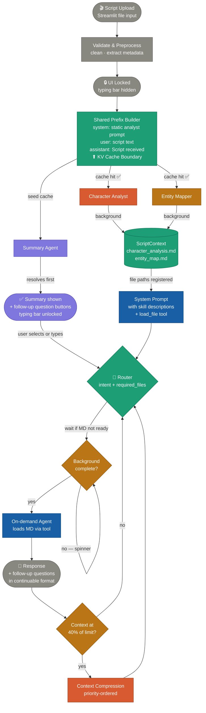
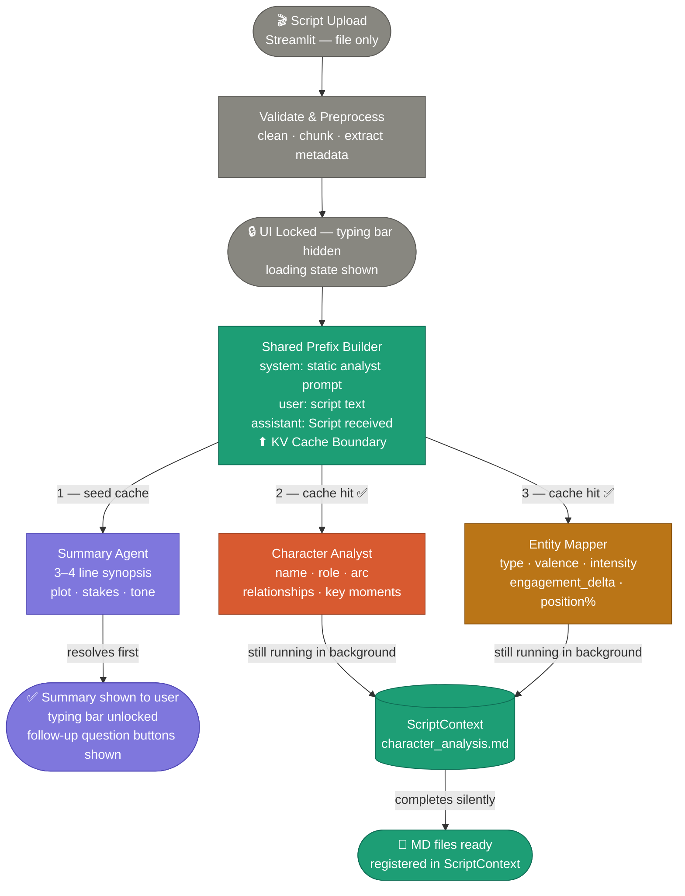
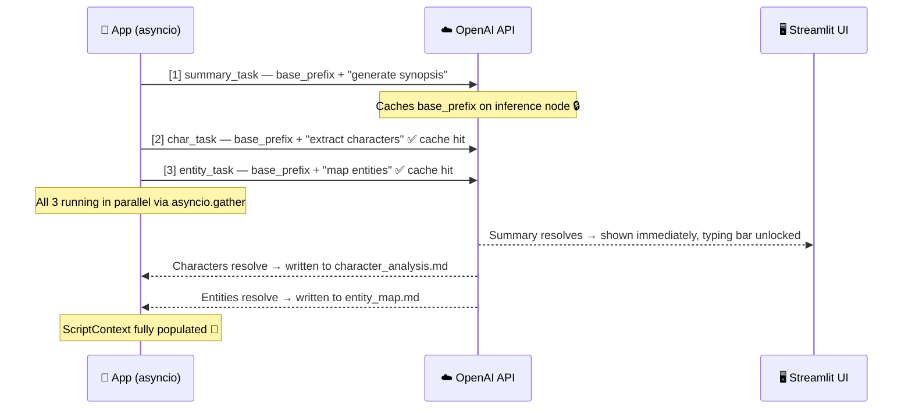
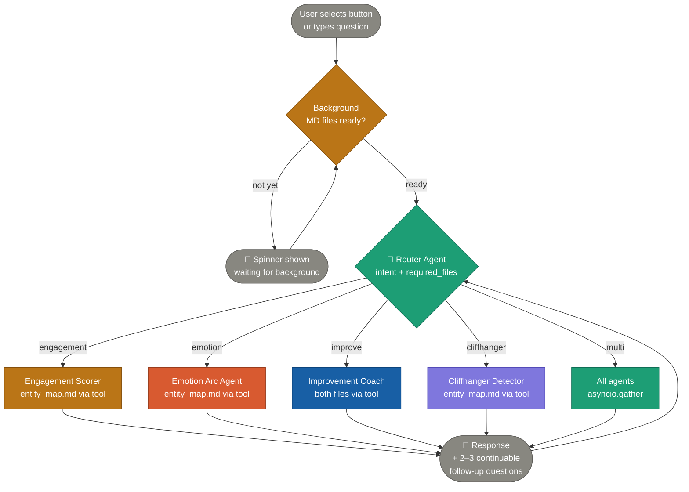
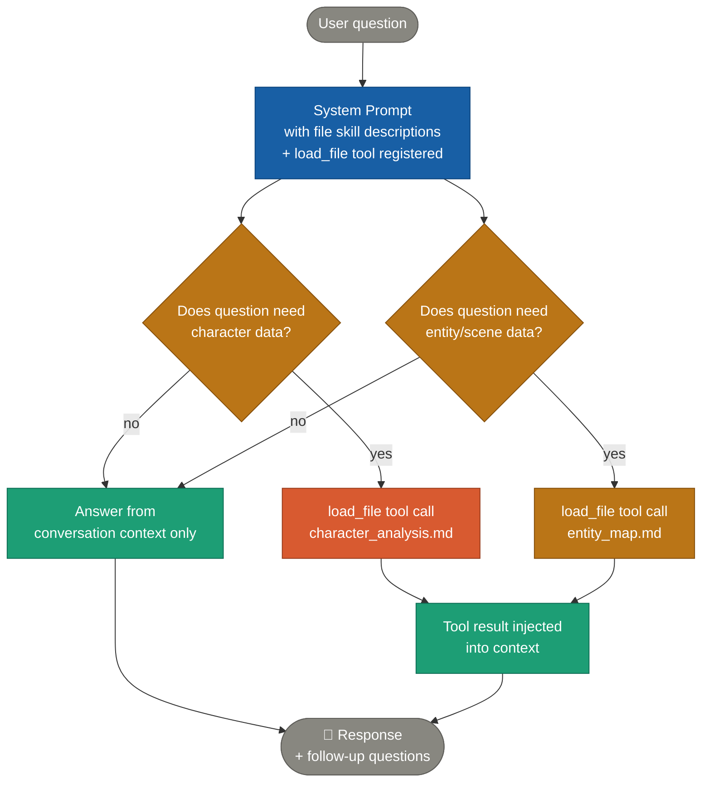
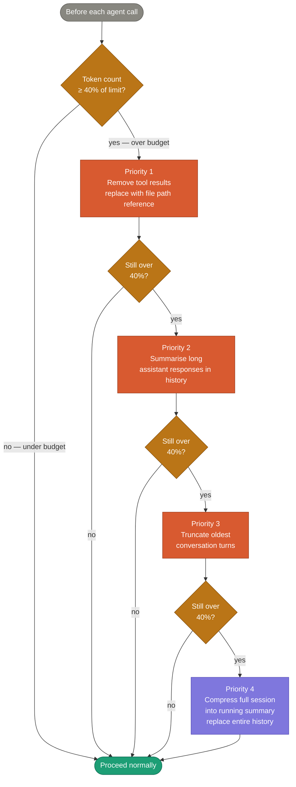

# Script Analysis System — Design Document

> AI Engineer Assignment | Bullet — Generative AI & Content Intelligence

---

## Overview

An agentic AI system that analyzes short-form scripts and generates structured storytelling insights.

Four phases drive the entire system:

1. **Phase 1 — Upload & Background Processing** — on script upload, generate summary immediately and run character + entity analysis in the background using shared KV cache. UI is locked until summary resolves. Pre-generated follow-up question buttons appear alongside the summary.
2. **Phase 2 — On-Demand Q&A** — user selects or types a question. Router classifies intent and loads the relevant MD file. Background agents must complete before MD is used. Never re-triggers Phase 1 subflows.
3. **Phase 3 — Tool-Use Conversation Architecture** — main conversation context is system-prompt-centric. System prompt registers file paths and describes each file's contents as skills. Model calls `load_file` tool on demand per question. Follow-up questions are generated in continuable format after every response.
4. **Phase 4 — Context Budget Management** — at 40% of model context window, compression runs in priority order: remove tool results → replace with file path references → summarise long responses → truncate oldest turns.

---

## Core Design Principles

| Principle | Description |
|---|---|
| **Progressive disclosure** | Summary shown instantly; UI locked until ready; deeper insights on demand |
| **Shared KV-cache prefix** | All background agents share identical system + script prefix for guaranteed cache hits |
| **Parallel background processing** | Summary, character analysis, entity mapping all fire simultaneously on upload |
| **ScriptContext as single source of truth** | All downstream agents use pre-built context — raw script never re-sent after Phase 1 |
| **Skill-based system prompt** | Each MD file is described as a named skill in the system prompt so the model knows when and why to load it |
| **On-demand tool loading** | Model calls `load_file` tool only when a question requires that file's data |
| **Continuable follow-up questions** | Every agent response ends with 2–3 follow-up questions that continue the conversation thread naturally |
| **Relative context budget** | Compression triggers at 40% of model context limit — not a fixed token number |
| **Priority-ordered compression** | Context freed in order: tool results → MD content → response summaries → oldest turns |

---

## System Architecture — Full Flow



---

## Phase 1 — Upload, Background Processing & Summary

### What happens

The Streamlit UI accepts only a script file (`.txt`, `.pdf`, `.docx`). Once uploaded, the typing bar is hidden and a loading state is shown. Three agents fire simultaneously — summary seeds the cache, character and entity hit it.



### Follow-up question buttons (shown alongside summary)

These are fixed pre-generated buttons — they appear the moment the summary resolves, before the MD files are done. If user clicks before MD is ready, a spinner shows and the agent fires the moment the file is available.

```
┌──────────────────────────────────────────────────────────┐
│  Summary: Riya receives a message from her ex-boyfriend  │
│  after five years. Arjun reveals the truth about an      │
│  accident she blamed herself for...                      │
└──────────────────────────────────────────────────────────┘

  [ 🎭 What is the emotion arc of this script? ]
  [ 📊 How engaging is this script and why?    ]
  [ ✍️ How can I improve this script?          ]
  [ 🎬 What is the cliffhanger moment?         ]
```

### KV cache firing sequence



### Code

```python
async def process_script(script: str) -> tuple[str, ScriptContext]:
    # [1] Fire summary FIRST — seeds the KV cache on OpenAI's inference node
    summary_task = asyncio.create_task(run_summary(script))

    # [2] Fire immediately after — milliseconds later, cache is warm
    char_task   = asyncio.create_task(run_character_analysis(script))
    entity_task = asyncio.create_task(run_entity_mapper(script))

    # [3] Summary resolves → show to user immediately
    summary = await summary_task
    yield summary  # Streamlit unlocks UI here

    # [4] Await remaining background tasks
    characters, entities = await asyncio.gather(char_task, entity_task)

    ctx = ScriptContext(
        summary=summary,
        characters=characters,
        entity_map=entities,
        char_md_path="outputs/character_analysis.md",
        entity_md_path="outputs/entity_map.md",
    )
    yield ctx  # ScriptContext now fully ready
```

> ⚠️ Use `create_task` for initial dispatch so summary is sent to OpenAI before the others, seeding the cache. Never use `asyncio.gather` for the initial fire — it sends all three simultaneously and loses the cache-seeding sequence.

---

## Phase 2 — On-Demand Follow-Up Q&A

### What happens

User either clicks a pre-generated question button or types their own question. The system classifies intent, checks whether the required MD file is ready, then loads it and answers. Phase 1 subflows (summary, character, entity agents) are **never re-triggered**.



### Router decision model

```python
class RouterDecision(BaseModel):
    intent: Literal["engagement", "emotion", "improve", "cliffhanger", "multi"]
    required_files: list[Literal["character_analysis.md", "entity_map.md"]]
    # engagement  → ["entity_map.md"]
    # emotion     → ["entity_map.md"]
    # improve     → ["character_analysis.md", "entity_map.md"]
    # cliffhanger → ["entity_map.md"]
    # multi       → ["character_analysis.md", "entity_map.md"]
```

### Continuable follow-up question format

Every agent response must end with 2–3 follow-up questions that are:
- **Specific** to what was just answered — not generic
- **Continuable** — each one can be clicked and produces a meaningful next response
- **Branching** — they go in different directions so user has real choices

**Example — after engagement score:**
```
Your script scores 7.4/10 for engagement. The cliffhanger is the 
strongest element (9/10). The tension buildup before the revelation 
is the weakest (6/10) — only one escalation beat before Arjun speaks.

Follow-up questions:
→ "Why did the tension buildup score lower than the cliffhanger?"
→ "What specific scene could I add to raise the tension score?"
→ "Show me the full breakdown of all engagement factors"
```

**Example — after emotion arc:**
```
The dominant emotions are grief, shock, and relief. The arc moves from 
anxiety (valence -0.3) through peak shock (valence -0.8) at the 
revelation, then partially resolves into relief (valence +0.4).

Follow-up questions:
→ "Which beat has the weakest emotional intensity and how do I fix it?"
→ "How does the emotion arc affect the engagement of the script?"
→ "Rewrite the final beat to leave the emotion more unresolved"
```

---

## Phase 3 — Tool-Use Conversation Architecture (System Prompt as Brain)

### Core idea

The main conversation context is built around a **skill-aware system prompt**. The system prompt tells the model what files exist, what each file contains, and when to load each one. The model calls `load_file` tool only when the question actually requires that data — it never loads both files for every question.



### System prompt structure

```python
MAIN_SYSTEM_PROMPT = """
You are a script analysis assistant. You help users understand and improve their scripts.

## Your skills (files you can load)

### Skill: character_analysis
- File: character_analysis.md
- Contains: character names, roles, dramatic arcs, relationships, key moments
- Load when: user asks about characters, motivations, relationships, or arc-level improvements

### Skill: entity_map
- File: entity_map.md  
- Contains: scene-level entities (hook, conflict, revelation, cliffhanger, etc.)
  each with valence (-1 to +1), intensity (0 to 1), engagement_delta, and position%
- Load when: user asks about emotion arc, engagement score, tension, 
  cliffhanger moment, or pacing

## Rules
- Load only the file the question actually needs. Do not load both for every question.
- After answering, always generate 2–3 follow-up questions specific to what you just said.
- Follow-up questions must be continuable — each one should lead naturally to the next answer.
- Never re-run the background analysis agents. Use only the MD files and conversation history.

## File paths
character_analysis.md → outputs/character_analysis.md
entity_map.md         → outputs/entity_map.md
"""
```

### The `load_file` tool definition

```python
tools = [
    {
        "type": "function",
        "function": {
            "name": "load_file",
            "description": (
                "Load a script analysis file to answer the user's question. "
                "Use character_analysis.md for character and arc questions. "
                "Use entity_map.md for emotion, engagement, tension, or cliffhanger questions."
            ),
            "parameters": {
                "type": "object",
                "properties": {
                    "filename": {
                        "type": "string",
                        "enum": ["character_analysis.md", "entity_map.md"],
                        "description": "The file to load"
                    }
                },
                "required": ["filename"]
            }
        }
    }
]
```

### Conversation message structure

```
messages = [
    {"role": "system",    "content": MAIN_SYSTEM_PROMPT},
    {"role": "user",      "content": "Here is the script:\n\n{script_text}"},
    {"role": "assistant", "content": "Script received. Here is the summary:\n\n{summary}\n\n{follow_up_questions}"},
    # --- subsequent turns ---
    {"role": "user",      "content": "What is the emotion arc?"},
    {"role": "assistant", "content": None, "tool_calls": [load_file("entity_map.md")]},
    {"role": "tool",      "content": "{entity_map contents}", "tool_call_id": "..."},
    {"role": "assistant", "content": "The emotion arc moves from...\n\n{follow_up_questions}"},
]
```

---

## Phase 4 — Context Budget Management

### Trigger

At **40% of the model's context window** (GPT-4o = 128k tokens → triggers at ~51,200 tokens), the context manager runs before the next agent call. Compression happens in strict priority order — stop as soon as the context drops below the threshold.



### Compression priority rules

| Priority | Action | What is removed | What replaces it | Reason |
|---|---|---|---|---|
| 1 | Remove tool results | Full `load_file` response content | File path string only | Tool results are the largest single item; model can reload on demand |
| 2 | Summarise long responses | Full assistant response text > 500 tokens | Compressed 2–3 sentence summary | Preserves the answer signal, removes verbose explanation |
| 3 | Truncate oldest turns | Earliest user + assistant turn pairs | Nothing (deleted) | Early turns are least contextually relevant to current question |
| 4 | Full session compression | Entire conversation history | Single compressed session summary | Last resort — preserves all key findings in minimal tokens |

### Context manager code

```python
MODEL_CONTEXT_LIMIT = 128_000   # GPT-4o
BUDGET_THRESHOLD    = 0.40      # trigger at 40%

def get_token_limit() -> int:
    return int(MODEL_CONTEXT_LIMIT * BUDGET_THRESHOLD)  # → 51,200 tokens

async def compress_context(messages: list[dict]) -> list[dict]:
    threshold = get_token_limit()

    # Priority 1 — remove tool results, replace with path reference
    if count_tokens(messages) >= threshold:
        messages = strip_tool_results(messages)

    # Priority 2 — summarise long assistant responses
    if count_tokens(messages) >= threshold:
        messages = summarise_long_responses(messages, max_tokens=500)

    # Priority 3 — truncate oldest turns (preserve system + first user turn)
    if count_tokens(messages) >= threshold:
        messages = truncate_oldest_turns(messages, keep_first=2)

    # Priority 4 — full session compression (async — makes an LLM call)
    if count_tokens(messages) >= threshold:
        messages = await compress_full_session(messages)

    return messages


def strip_tool_results(messages: list[dict]) -> list[dict]:
    result = []
    for msg in messages:
        if msg["role"] == "tool":
            # Replace full content with a path-only reference
            filename = extract_filename_from_tool_call(msg)
            result.append({
                "role": "tool",
                "content": f"[File content removed to save context. Path: outputs/{filename}]",
                "tool_call_id": msg["tool_call_id"]
            })
        else:
            result.append(msg)
    return result


async def compress_full_session(messages: list[dict]) -> list[dict]:
    history_text = json.dumps(messages[2:])  # Skip system + script turn
    prompt = f"""
    Summarise this script analysis session into a compact context block.
    Preserve:
    - All scores, arc beats, entity findings already generated
    - What the user asked and what was answered
    - Any pending follow-up threads not yet answered
    Do not include raw file contents.
    
    Session:
    {history_text}
    """
    compressed = await call_llm(prompt)
    return [
        messages[0],   # system prompt — always keep
        messages[1],   # script upload turn — always keep
        {"role": "assistant", "content": f"[Compressed session context]\n{compressed}"}
    ]
```

---

## Agent Definitions

### 1. Summary Agent
| Field | Value |
|---|---|
| Trigger | Automatic on upload — Phase 1 |
| Mode | Background — parallel, seeds KV cache |
| Input | Script text via shared prefix |
| Output | 3–4 sentence synopsis: plot · stakes · tone |
| Shown to user | Yes — immediately on resolve, unlocks UI |

**Follow-up questions generated after summary:**
```
→ "What is the emotion arc of this script?"
→ "How engaging is this script and what are the key factors?"
→ "What are the main strengths and weaknesses of this script?"
```

---

### 2. Character Analyst
| Field | Value |
|---|---|
| Trigger | Automatic on upload — Phase 1, parallel |
| Mode | Background (cache hit) — writes to ScriptContext |
| Input | Script text via shared prefix |
| Output | `character_analysis.md` |

**Sample output:**
```markdown
### Riya
- Role: Protagonist
- Arc: Guilt → Absolution
- Key moments: Receives the message, confronts Arjun
- Relationships: Ex-girlfriend of Arjun

### Arjun
- Role: Catalyst
- Arc: Withholding truth → Revelation
- Key moments: Delivers truth about the accident
- Relationships: Ex-boyfriend of Riya
```

---

### 3. Entity Mapper
| Field | Value |
|---|---|
| Trigger | Automatic on upload — Phase 1, parallel |
| Mode | Background (cache hit) — writes to ScriptContext |
| Input | Script text via shared prefix |
| Output | `entity_map.md` |

**Pydantic schema:**
```python
class SceneEntity(BaseModel):
    scene_id:         int
    entity_type:      Literal[
                          "hook", "conflict", "revelation", "false_death",
                          "cliffhanger", "tension_build", "resolution"
                      ]
    valence:          float   # -1.0 (sad/negative) → +1.0 (joyful/positive)
    intensity:        float   # 0.0 (weak) → 1.0 (extremely strong)
    engagement_delta: float   # -1.0 → +1.0 (audience attention gain or loss)
    position_pct:     float   # 0–100, where in the script this scene falls
    description:      str     # one-line explanation of the moment
```

> Powers: emotion arc (valence over position), cliffhanger detection (high intensity + engagement_delta near position_pct 70–100), engagement scoring (entity type weights).

---

### 4. Router Agent
| Field | Value |
|---|---|
| Trigger | Every user message — Phase 2 onwards |
| Mode | Single lightweight LLM call — structured output |
| Input | User message string |
| Output | `RouterDecision`: intent + required_files |

**System prompt:**
```
You are an intent classifier for a script analysis system.
Return a JSON object with:

"intent": one of ["engagement", "emotion", "improve", "cliffhanger", "multi"]
"required_files": subset of ["character_analysis.md", "entity_map.md"]

Rules:
- engagement  → ["entity_map.md"]
- emotion     → ["entity_map.md"]
- improve     → ["character_analysis.md", "entity_map.md"]
- cliffhanger → ["entity_map.md"]
- multi       → ["character_analysis.md", "entity_map.md"]

Return valid JSON only.
```

---

### 5. Engagement Scorer
| Field | Value |
|---|---|
| Trigger | On-demand — Phase 2 |
| Input | entity_map.md loaded via `load_file` tool |
| Output | Score + factor breakdown + follow-up questions |

```json
{
  "overall_score": 7.4,
  "factors": {
    "hook_strength":     8,
    "conflict_depth":    7,
    "tension_buildup":   6,
    "cliffhanger":       9,
    "emotional_stakes":  7
  },
  "explanation": "Strong opening hook via the unexpected message after 5 years. Cliffhanger lands well. Tension buildup is the weakest element — only one escalation beat before the revelation.",
  "follow_up_questions": [
    "Why did the tension buildup score lower than the cliffhanger?",
    "What specific beat could I add to raise the tension score above 8?",
    "Show me which scene in the entity map has the highest engagement delta"
  ]
}
```

---

### 6. Emotion Arc Agent
| Field | Value |
|---|---|
| Trigger | On-demand — Phase 2 |
| Input | entity_map.md loaded via `load_file` tool |
| Output | Beat-by-beat arc + dominant emotions + follow-up questions |

**Pydantic schema:**
```python
class ArcBeat(BaseModel):
    position_pct: float   # 0–100
    emotion:      str     # label at this beat
    valence:      float   # from entity map
    intensity:    float   # from entity map
    description:  str     # one-line summary

class EmotionArc(BaseModel):
    dominant_emotions:  list[str]
    arc_beats:          list[ArcBeat]
    overall_tone:       str
    follow_up_questions: list[str]   # always 2–3, continuable
```

**Sample output:**
```
Dominant emotions: grief, shock, relief
Overall tone: melancholic with a redemptive turn

Beat 1 (0–20%):   Anxiety · valence -0.3 · intensity 0.5 — Riya opens unexpected message
Beat 2 (20–50%):  Tension · valence -0.6 · intensity 0.7 — confrontational exchange
Beat 3 (50–80%):  Shock   · valence -0.8 · intensity 0.9 — accident truth revealed
Beat 4 (80–100%): Relief  · valence +0.4 · intensity 0.8 — partial absolution

Follow-up questions:
→ "Which beat has the weakest emotional intensity and how can I strengthen it?"
→ "How does this emotion arc compare to a strong short-form script structure?"
→ "Rewrite the final beat to leave the emotion more unresolved and ambiguous"
```

---

### 7. Improvement Coach
| Field | Value |
|---|---|
| Trigger | On-demand — Phase 2 |
| Input | Both MD files via `load_file` tool + `script_context.suggested_improvements` to avoid repetition |
| Output | Structured suggestions per dimension + follow-up questions |

**Sample output:**
```markdown
## Suggestions

### Pacing
- Revelation arrives too quickly — add a beat of hesitation from Arjun

### Dialogue
- "Because today I learned the truth" is on-the-nose — show through behaviour

### Emotional impact
- Give Riya a physical reaction (silence, breath, gesture) to anchor the audience

### Conflict
- The conflict resolves too cleanly — leave Riya's response ambiguous

## Follow-up questions
→ "Rewrite Arjun's reveal line to be less direct and more behavioural"
→ "Suggest a new opening beat that builds more dread before the message arrives"
→ "Show me what the pacing looks like if I add the hesitation beat you suggested"
```

---

### 8. Cliffhanger Detector *(optional — bundled with engagement or standalone)*
| Field | Value |
|---|---|
| Trigger | On-demand — Phase 2 |
| Input | entity_map.md — finds max `intensity` + high `engagement_delta` where `position_pct` ≥ 70 |
| Output | Scene description + explanation + follow-up questions |

**Sample output:**
```
Cliffhanger moment: Scene 3 (position 75%) — Arjun says "the accident wasn't your fault"

Why it works:
- Highest intensity in the script (0.9)
- Reveals information that reframes everything the audience thought they knew
- Arrives at the 75% mark — late enough to feel earned, early enough to leave resolution open

Follow-up questions:
→ "How can I make the lead-up to this moment build more tension?"
→ "Is the cliffhanger strong enough to end the scene here, or does it need a response beat?"
→ "What would happen to the engagement score if I moved this reveal to 90%?"
```

---

## ScriptContext — Single Source of Truth

```python
from dataclasses import dataclass, field

@dataclass
class ScriptContext:
    raw_script:              str                 # original upload text
    summary:                 str                 # from Summary Agent
    characters:              list[Character]     # from Character Analyst
    entity_map:              list[SceneEntity]   # from Entity Mapper
    char_md_path:            str                 # path → character_analysis.md
    entity_md_path:          str                 # path → entity_map.md
    suggested_improvements:  list[str] = field(default_factory=list)
    # ↑ tracks what Improvement Coach already suggested — avoids repetition in follow-ups
    session_token_count:     int = 0
    # ↑ updated after every turn — triggers Phase 4 compression at 40% threshold
```

**Rule:** Every on-demand agent in Phase 2–3 receives only `ScriptContext`. Raw script is never re-sent after Phase 1.

---

## Project Structure

```
script-analysis/
│
├── agents/
│   ├── summary.py           # Phase 1 — Summary Agent
│   ├── characters.py        # Phase 1 — Character Analyst
│   ├── entity_mapper.py     # Phase 1 — Entity Mapper
│   ├── router.py            # Phase 2 — Router Agent
│   ├── engagement.py        # Phase 2 — Engagement Scorer
│   ├── emotion_arc.py       # Phase 2 — Emotion Arc Agent
│   ├── improvement.py       # Phase 2 — Improvement Coach
│   └── cliffhanger.py       # Phase 2 — Cliffhanger Detector
│
├── core/
│   ├── context.py           # ScriptContext dataclass
│   ├── pipeline.py          # process_script() — Phase 1 orchestrator
│   ├── context_manager.py   # compress_context() — Phase 4 priority compression
│   ├── session.py           # compress_full_session() — Phase 4 last resort
│   └── prompts.py           # MAIN_SYSTEM_PROMPT + all agent prompt templates
│
├── models/
│   ├── entities.py          # SceneEntity Pydantic model
│   ├── characters.py        # Character Pydantic model
│   ├── router.py            # RouterDecision Pydantic model
│   └── outputs.py           # EngagementScore, EmotionArc, ArcBeat etc.
│
├── ui/
│   └── app.py               # Streamlit — file upload, locked state, follow-up buttons
│
├── outputs/                 # generated .md files per script run
│   ├── character_analysis.md
│   └── entity_map.md
│
├── requirements.txt
└── README.md
```

---

## Tech Stack

| Layer | Choice | Reason |
|---|---|---|
| LLM | OpenAI GPT-4o | Structured output + 128k context + prompt caching |
| Async | `asyncio` + `create_task` + `gather` | Parallel Phase 1 agents with cache-seeding order |
| Token counting | `tiktoken` | Accurate 40% budget threshold per turn |
| Validation | `pydantic` v2 | Typed outputs: RouterDecision, SceneEntity, EmotionArc |
| UI | Streamlit | File upload, locked state, follow-up buttons, streaming |
| File output | `.md` per analysis | Human-readable, lazy-loadable via `load_file` tool |
| Orchestration | Raw Python | No LangChain needed — clean and easy to explain in demo |

---

## Limitations

- Short scripts only (< ~4000 tokens) — no chunking strategy yet
- KV cache hit not guaranteed — depends on OpenAI routing same prefix to same inference node
- No session persistence — ScriptContext lost on Streamlit restart
- Context compression at Priority 4 loses fine-grained conversation detail — trade-off by design
- Follow-up questions are LLM-generated — quality depends on model output consistency
- No speaker diarization for complex multi-character dialogue

---

## Possible Improvements

- Chunking + map-reduce for feature-length scripts
- Persist ScriptContext to SQLite or Redis for session resumption
- Embeddings-based semantic search over MD files instead of full file loading
- Stream tokens from each Phase 2 agent to Streamlit for lower perceived latency
- Multi-script comparison mode (compare two drafts, show what changed in arc/engagement)
- Fine-tune a small classifier for entity type labelling to remove LLM hallucination risk
- Confidence scores on engagement factors and emotion labels