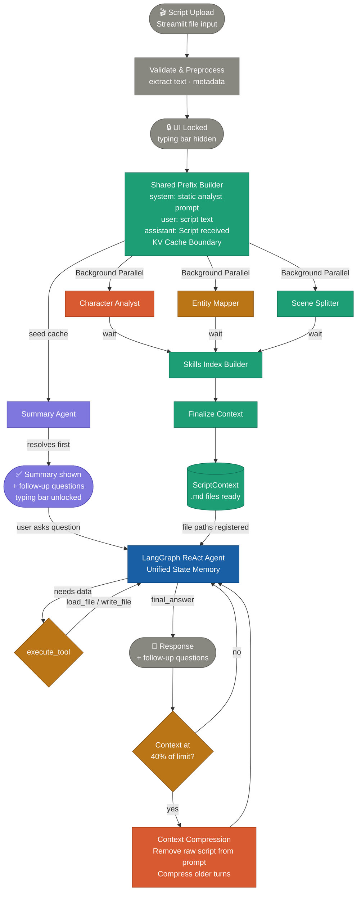
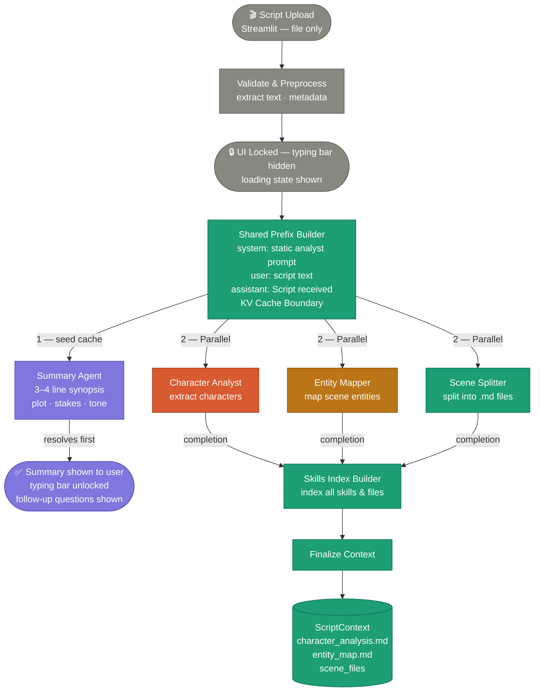
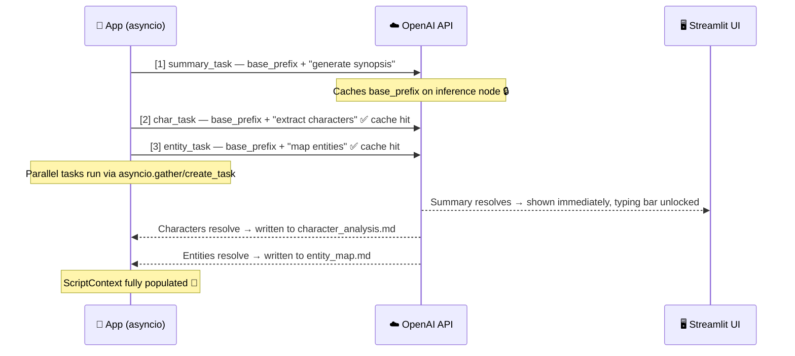
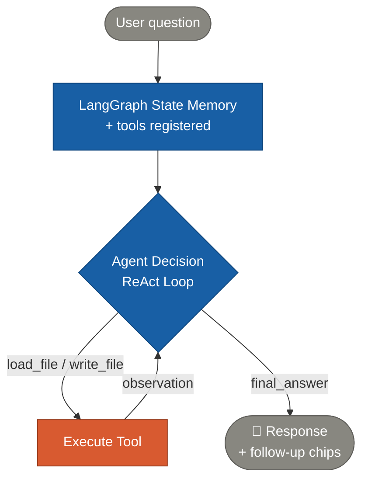

# Script Analysis System — Design Document

> AI Engineer Assignment | Bullet — Generative AI & Content Intelligence

---

## Overview

An agentic AI system that analyzes short-form scripts and generates structured storytelling insights through a unified, memory-aware pipeline.

The system follows a continuous intelligence loop:

1. **Upload & Initial Insight** — On script upload, a summary is generated immediately while character analysis, entity mapping, and scene splitting run in the background using a shared KV cache.
2. **Stateful Conversation Agent** — A LangGraph-based ReAct agent maintains conversation memory and uses specialized tools to pull deep insights from the pre-generated analysis files.
3. **Context Budget Management** — Automated context engineering triggers at 40% of the model's limit, compressing the history and removing the raw script to maintain optimal performance.

---

## Core Design Principles

| Principle | Description |
|---|---|
| **Progressive disclosure** | Summary shown instantly; background analysis completes silently; deeper insights on demand |
| **Shared KV-cache prefix** | Background tasks share a common system + script prefix to maximize prompt caching performance |
| **Parallel Processing** | Summary, character analysis, entity mapping, and scene splitting execute concurrently on upload |
| **Unified Context** | A single `ScriptContext` serves as the source of truth for all downstream tools and responses |
| **Skill-based Architecture** | Generated analysis files are treated as "skills" that the agent can load only when relevant |
| **ReAct Tool Pattern** | The model reasons about questions and autonomously calls `load_file` or `write_file` to fulfill requests |
| **Context Awareness** | Automatic compression and script-dropping at 40% context budget to avoid window overflow |
| **Interactive Feedback** | Every response ends with contextually relevant "follow-up chips" to guide the user deeper |

---

## System Architecture — Unified Flow



---

## Background Analysis & Initial Summary

### Orchestration

The system uses `asyncio` to manage concurrency. The summary seeds the KV cache, while the deep analysts (Character, Entity, Scene) follow immediately to hit the warm cache.



### KV Cache Firing Sequence



---

## Unified Tool-Use Conversation Architecture

### Intelligent Retrieval

Instead of static routing, the conversation agent uses a ReAct (Reasoning and Acting) loop. It evaluates the user's question, determines which analysis file contains the answer, and uses tools to load that data into its working memory.



### System Prompt Structure

The agent is instructed to treat each generated file as a "skill".

```python
MAIN_SYSTEM_PROMPT = """
You are a script analysis assistant. You help users understand and improve their scripts.
You can answer questions about engagement, emotional arcs, cliffhangers, and improvements.

## Your skills (files you can load)

### Skill: character_analysis
- File: character_analysis.md
- Contains: character names, roles, dramatic arcs, relationships, key moments

### Skill: entity_map
- File: entity_map.md  
- Contains: scene-level entities (hook, conflict, revelation, etc.)

## Rules
- Load only the file the question actually needs using your tools.
- After answering, always generate 2–3 follow-up question chips.
- Never re-run background analysis. Use only the MD files and history.
"""
```

---

## Context Budget Management

### Strategy

- **Trigger**: Runs at **40% of the model's context window**.
- **Priority 1**: Drop the raw script message (retained only for the initial summary seeding).
- **Priority 2**: Truncate/Compress older turns while keeping the system prompt and the latest context.

---

## Project Structure

```
script-analysis/
│
├── agents/
│   ├── summary.py           # Initial Summary Generator
│   ├── characters.py        # Character Analyst
│   ├── entity_mapper.py     # Entity Mapper
│   ├── scene_splitter.py    # Script Scene Fragmenter
│   ├── skills_index_builder.py # Skills/Files Indexer
│   └── conversation_graph.py# Stateful ReAct Agent (LangGraph)
│
├── core/
│   ├── context.py           # ScriptContext source of truth
│   ├── pipeline.py          # Pipeline orchestration
│   ├── context_manager.py   # 40% threshold compression logic
│   ├── llm.py               # Structured output & token tracking
│   └── prompts.py           # Dynamic system prompt builder
│
├── models/                  # Pydantic output schemas
│   ├── entities.py          
│   ├── characters.py        
│   └── summary.py           
│
├── ui/
│   └── app.py               # Streamlit Dashboard & Chat Interface
│
├── outputs/                 # Analysis assets
│   ├── character_analysis.md
│   ├── entity_map.md
│   └── skills_index.md
│
└── requirements.txt
```

---

## Tech Stack

| Layer | Choice | Reason |
|---|---|---|
| **LLM** | GPT-4o | Structured output + prompt caching + 128k window |
| **Logic** | Python / Asyncio | High concurrency for background tasks |
| **Orchestration** | LangGraph | State management for tool-use loops |
| **Parsing** | Pydantic v2 | Guaranteed schema compliance for all agents |
| **UI** | Streamlit | Rapid prototyping with native chat & file support |
| **Memory** | ScriptContext | Centralized state to avoid redundant LLM calls |

---

## Possible Improvements

- Chunking + map-reduce for feature-length scripts
- Persist ScriptContext to SQLite or Redis for session resumption
- Embeddings-based semantic search over MD files instead of full file loading
- Stream tokens from each Phase 2 agent to Streamlit for lower perceived latency
- Multi-script comparison mode (compare two drafts, show what changed in arc/engagement)
- Fine-tune a small classifier for entity type labelling to remove LLM hallucination risk
- Confidence scores on engagement factors and emotion labels