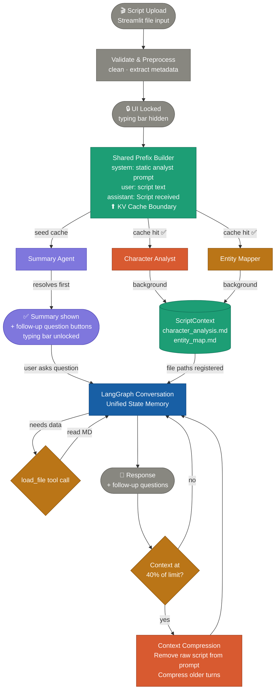
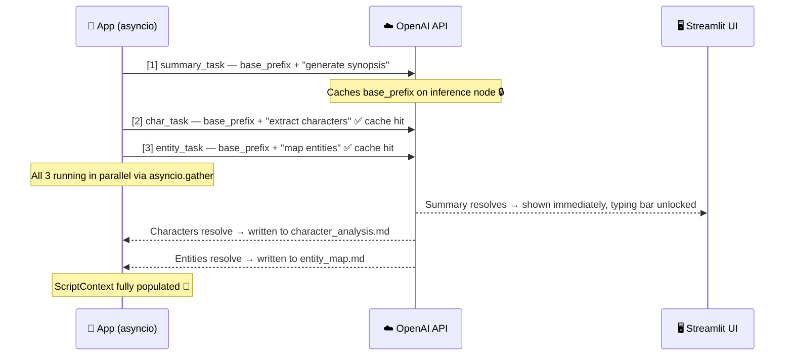
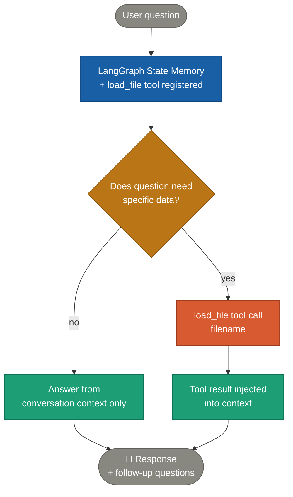

# Script Analysis System — Design Document

> AI Engineer Assignment | Bullet — Generative AI & Content Intelligence

---

## Overview

An agentic AI system that analyzes short-form scripts and generates structured storytelling insights.

Four phases drive the entire system:

1. **Phase 1 — Upload & Background Processing** — on script upload, generate summary immediately and run character + entity analysis in the background using shared KV cache. UI is locked until summary resolves. Pre-generated follow-up question buttons appear alongside the summary.
2. **Phase 2 — Unified Tool-Use Architecture** — main conversation context is stateful. Initial prompt includes the script until the context hits 40%. The model has access to the `load_file` tool to read `character_analysis.md` and `entity_map.md` when answering questions.
3. **Phase 3 — Context Budget Management** — at 40% of model context window, context engineering triggers to compress information, and importantly the raw script is removed from the system prompt to maintain memory limit.

---

## Core Design Principles

| Principle | Description |
|---|---|
| **Progressive disclosure** | Summary shown instantly; UI locked until ready; deeper insights on demand |
| **Shared KV-cache prefix** | All background agents share identical system + script prefix for guaranteed cache hits |
| **Parallel background processing** | Summary, character analysis, entity mapping all fire simultaneously on upload |
| **ScriptContext as single source of truth** | All downstream agents use pre-built context — raw script never re-sent after Phase 1 |
| **Skill-based system prompt** | Each MD file is described as a named skill in the system prompt so the model knows when and why to load it |
| **On-demand tool loading** | Model calls `load_file` tool only when a question requires that file's data |
| **Continuable follow-up questions** | Every agent response ends with 2–3 follow-up questions that continue the conversation thread naturally |
| **Relative context budget** | Compression triggers at 40% of model context limit — not a fixed token number |
| **Priority-ordered compression** | Context freed in order: tool results → MD content → response summaries → oldest turns |

---

## System Architecture — Full Flow



---

## Phase 1 — Upload, Background Processing & Summary

### What happens

The Streamlit UI accepts only a script file (`.txt`, `.pdf`, `.docx`). Once uploaded, the typing bar is hidden and a loading state is shown. Three agents fire simultaneously — summary seeds the cache, character and entity hit it.


### Follow-up question buttons (shown alongside summary)

These are fixed pre-generated buttons — they appear the moment the summary resolves, before the MD files are done. If user clicks before MD is ready, a spinner shows and the agent fires the moment the file is available.

```
┌──────────────────────────────────────────────────────────┐
│  Summary: Riya receives a message from her ex-boyfriend  │
│  after five years. Arjun reveals the truth about an      │
│  accident she blamed herself for...                      │
└──────────────────────────────────────────────────────────┘

  [ 🎭 What is the emotion arc of this script? ]
  [ 📊 How engaging is this script and why?    ]
  [ ✍️ How can I improve this script?          ]
  [ 🎬 What is the cliffhanger moment?         ]
```

### KV cache firing sequence



### Code

```python
async def process_script(script: str) -> tuple[str, ScriptContext]:
    # [1] Fire summary FIRST — seeds the KV cache on OpenAI's inference node
    summary_task = asyncio.create_task(run_summary(script))

    # [2] Fire immediately after — milliseconds later, cache is warm
    char_task   = asyncio.create_task(run_character_analysis(script))
    entity_task = asyncio.create_task(run_entity_mapper(script))

    # [3] Summary resolves → show to user immediately
    summary = await summary_task
    yield summary  # Streamlit unlocks UI here

    # [4] Await remaining background tasks
    characters, entities = await asyncio.gather(char_task, entity_task)

    ctx = ScriptContext(
        summary=summary,
        characters=characters,
        entity_map=entities,
        char_md_path="outputs/character_analysis.md",
        entity_md_path="outputs/entity_map.md",
    )
    yield ctx  # ScriptContext now fully ready
```

> ⚠️ Use `create_task` for initial dispatch so summary is sent to OpenAI before the others, seeding the cache. Never use `asyncio.gather` for the initial fire — it sends all three simultaneously and loses the cache-seeding sequence.

---

## Phase 2 — Unified Tool-Use Conversation Architecture

### Core idea

The main conversation context is stateful. We do not use distinct specialized "sub-flow" routing graphs. Instead, we have a **unified main flow** via a LangGraph StateGraph that holds message history. The system prompt registers file paths and describes each file's contents as skills. The model calls the `load_file` tool on demand to read `character_analysis.md` and `entity_map.md`.



### System prompt structure

```python
MAIN_SYSTEM_PROMPT = """
You are a script analysis assistant. You help users understand and improve their scripts.
You can answer questions about engagement, emotional arcs, cliffhangers, and improvements.

## Your skills (files you can load)

### Skill: character_analysis
- File: character_analysis.md
- Contains: character names, roles, dramatic arcs, relationships, key moments

### Skill: entity_map
- File: entity_map.md  
- Contains: scene-level entities (hook, conflict, revelation, cliffhanger, etc.)
  each with valence (-1 to +1), intensity (0 to 1), engagement_delta, and position%

## Rules
- Load only the file the question actually needs using your tools.
- After answering, always generate 2–3 follow-up questions specific to what you just said.
- Never re-run the background analysis agents. Use only the MD files and conversation history.
"""
```

### The `load_file` tool definition

```python
tools = [
    {
        "type": "function",
        "function": {
            "name": "load_file",
            "description": "Load a script analysis file to answer the user's question.",
            "parameters": {
                "type": "object",
                "properties": {
                    "filename": {
                        "type": "string",
                        "enum": ["outputs/character_analysis.md", "outputs/entity_map.md"],
                        "description": "The file to load"
                    }
                },
                "required": ["filename"]
            }
        }
    }
]
```

---

## Phase 3 — Context Budget Management

### Trigger

At **40% of the model's context window**, the context manager runs.

### Strategy

- **Initial State**: The system memory retains the `SHARED_PREFIX_SYSTEM` initialized with the raw script provided during Phase 1.
- **Threshold Limit**: Once the context hits 40%, the system drops the raw script from the prompt completely to conserve memory, keeping only the summary and subsequent `Agent` messages.
- **Ongoing Compression**: After dropping the script, if the context hits 40% again, the system compresses the oldest turns in the buffer.

---

## Agent Definitions

### 1. Summary Agent
| Field | Value |
|---|---|
| Trigger | Automatic on upload — Phase 1 |
| Mode | Background — parallel, seeds KV cache |
| Input | Script text via shared prefix |
| Output | 3–4 sentence synopsis: plot · stakes · tone |
| Shown to user | Yes — immediately on resolve, unlocks UI |

**Follow-up questions generated after summary:**
```
→ "What is the emotion arc of this script?"
→ "How engaging is this script and what are the key factors?"
→ "What are the main strengths and weaknesses of this script?"
```

---

### 2. Character Analyst
| Field | Value |
|---|---|
| Trigger | Automatic on upload — Phase 1, parallel |
| Mode | Background (cache hit) — writes to ScriptContext |
| Input | Script text via shared prefix |
| Output | `character_analysis.md` |

**Sample output:**
```markdown
### Riya
- Role: Protagonist
- Arc: Guilt → Absolution
- Key moments: Receives the message, confronts Arjun
- Relationships: Ex-girlfriend of Arjun

### Arjun
- Role: Catalyst
- Arc: Withholding truth → Revelation
- Key moments: Delivers truth about the accident
- Relationships: Ex-boyfriend of Riya
```

---

### 3. Entity Mapper
| Field | Value |
|---|---|
| Trigger | Automatic on upload — Phase 1, parallel |
| Mode | Background (cache hit) — writes to ScriptContext |
| Input | Script text via shared prefix |
| Output | `entity_map.md` |

**Pydantic schema:**
```python
class SceneEntity(BaseModel):
    scene_id:         int
    entity_type:      Literal[
                          "hook", "conflict", "revelation", "false_death",
                          "cliffhanger", "tension_build", "resolution"
                      ]
    valence:          float   # -1.0 (sad/negative) → +1.0 (joyful/positive)
    intensity:        float   # 0.0 (weak) → 1.0 (extremely strong)
    engagement_delta: float   # -1.0 → +1.0 (audience attention gain or loss)
    position_pct:     float   # 0–100, where in the script this scene falls
    description:      str     # one-line explanation of the moment
```

> Powers: emotion arc (valence over position), cliffhanger detection (high intensity + engagement_delta near position_pct 70–100), engagement scoring (entity type weights).


## ScriptContext — Single Source of Truth

```python
from dataclasses import dataclass, field

@dataclass
class ScriptContext:
    raw_script:              str                 # original upload text
    summary:                 str                 # from Summary Agent
    characters:              list[Character]     # from Character Analyst
    entity_map:              list[SceneEntity]   # from Entity Mapper
    char_md_path:            str                 # path → character_analysis.md
    entity_md_path:          str                 # path → entity_map.md
    suggested_improvements:  list[str] = field(default_factory=list)
    # ↑ tracks what Improvement Coach already suggested — avoids repetition in follow-ups
    session_token_count:     int = 0
    # ↑ updated after every turn — triggers Phase 4 compression at 40% threshold
```

**Rule:** Every on-demand agent in Phase 2–3 receives only `ScriptContext`. Raw script is never re-sent after Phase 1.

---

## Project Structure

```
script-analysis/
│
├── agents/
│   ├── summary.py           # Phase 1 — Summary Agent
│   ├── characters.py        # Phase 1 — Character Analyst
│   ├── entity_mapper.py     # Phase 1 — Entity Mapper
│   └── conversation_graph.py# Phase 2 — Main stateful LangGraph node
│
├── core/
│   ├── context.py           # ScriptContext dataclass
│   ├── pipeline.py          # process_script() — Phase 1 orchestrator
│   ├── context_manager.py   # compress_context() — Phase 4 priority compression
│   ├── session.py           # compress_full_session() — Phase 4 last resort
│   └── prompts.py           # MAIN_SYSTEM_PROMPT + all agent prompt templates
│
├── models/
│   ├── entities.py          # SceneEntity Pydantic model
│   ├── characters.py        # Character Pydantic model
│   ├── router.py            # RouterDecision Pydantic model
│   └── outputs.py           # EngagementScore, EmotionArc, ArcBeat etc.
│
├── ui/
│   └── app.py               # Streamlit — file upload, locked state, follow-up buttons
│
├── outputs/                 # generated .md files per script run
│   ├── character_analysis.md
│   └── entity_map.md
│
├── requirements.txt
└── README.md
```

---

## Tech Stack

| Layer | Choice | Reason |
|---|---|---|
| LLM | OpenAI GPT-4o | Structured output + 128k context + prompt caching |
| Async | `asyncio` + `create_task` + `gather` | Parallel Phase 1 agents with cache-seeding order |
| Token counting | `tiktoken` | Accurate 40% budget threshold per turn |
| Validation | `pydantic` v2 | Typed outputs: RouterDecision, SceneEntity, EmotionArc |
| UI | Streamlit | File upload, locked state, follow-up buttons, streaming |
| File output | `.md` per analysis | Human-readable, lazy-loadable via `load_file` tool |
| Orchestration | Raw Python | No LangChain needed — clean and easy to explain in demo |

---

## Limitations

- Short scripts only (< ~4000 tokens) — no chunking strategy yet
- KV cache hit not guaranteed — depends on OpenAI routing same prefix to same inference node
- No session persistence — ScriptContext lost on Streamlit restart
- Context compression at Priority 4 loses fine-grained conversation detail — trade-off by design
- Follow-up questions are LLM-generated — quality depends on model output consistency
- No speaker diarization for complex multi-character dialogue

---

## Possible Improvements

- Chunking + map-reduce for feature-length scripts
- Persist ScriptContext to SQLite or Redis for session resumption
- Embeddings-based semantic search over MD files instead of full file loading
- Stream tokens from each Phase 2 agent to Streamlit for lower perceived latency
- Multi-script comparison mode (compare two drafts, show what changed in arc/engagement)
- Fine-tune a small classifier for entity type labelling to remove LLM hallucination risk
- Confidence scores on engagement factors and emotion labels